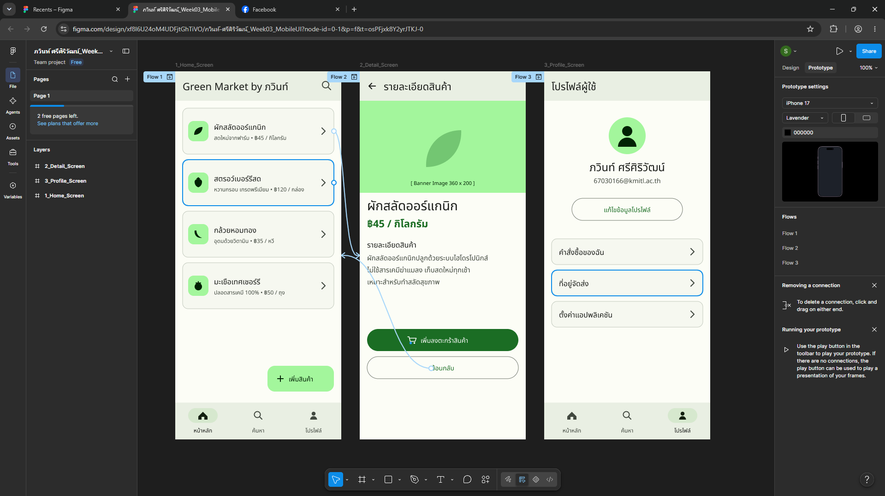
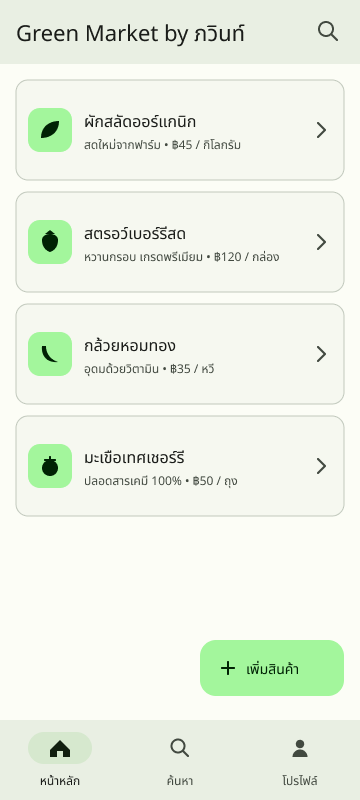
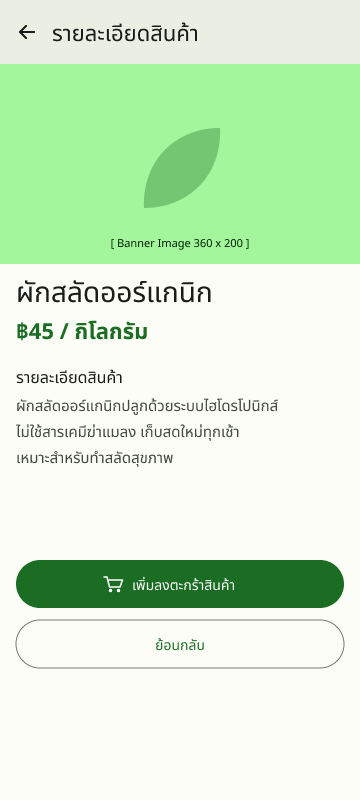
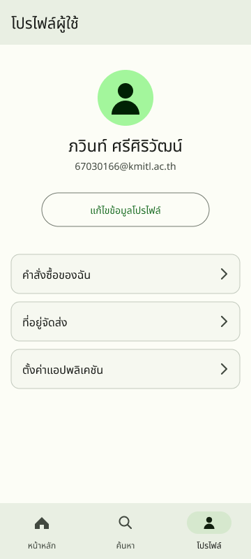
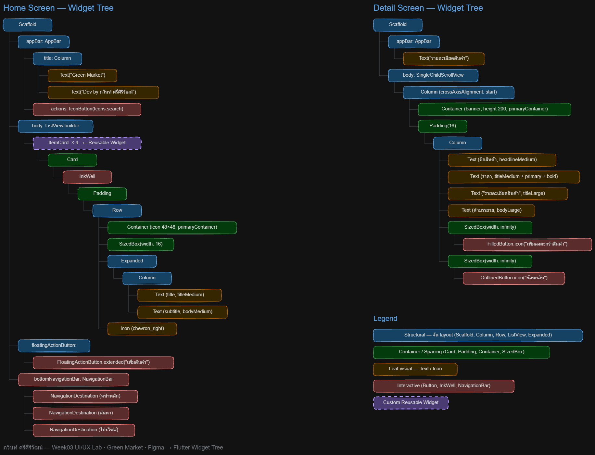

# 📱 ใบงานปฏิบัติที่ 3: UI/UX Design — จาก Mockup สู่ Flutter

> **วิชา:** การพัฒนาซอฟต์แวร์สำหรับอุปกรณ์เคลื่อนที่  
> **สัปดาห์ที่:** 3  
> **เวลา:** 3.5 ชั่วโมง  


---

## 🎯 วัตถุประสงค์การเรียนรู้

หลังจากทำใบงานนี้แล้ว นักศึกษาจะสามารถ:

1. อธิบายหลักการสำคัญของ Material Design 3 ได้
2. สร้าง UI Mockup ด้วย Figma โดยใช้หลักการ Material Design 3 Component ได้
3. แปลงการออกแบบ UI เป็น Widget Tree ใน Flutter ได้
4. สร้าง Reusable Widget ด้วย Flutter ตามหลัก Component-Driven Design ได้
5. ใช้ AI (Google AI Studio) ช่วยสร้าง UI Component ได้

---

## 📚 ทฤษฎีก่อนการทดลอง

### ส่วนที่ 1: Material Design 3

Material Design 3 (Material You) คือ Design System ของ Google เวอร์ชันล่าสุด (2021–ปัจจุบัน) มีหลักการสำคัญ 3 ด้าน:

#### 1.1 Dynamic Color System

Material 3 สร้าง Color Scheme อัตโนมัติจากสี seed สีเดียว โดยแบ่งเป็น **Tonal Palettes:**

```
Primary    → ใช้กับ action หลัก, FAB, Checkbox ที่เลือกแล้ว
Secondary  → ใช้กับ filter chip, secondary action
Tertiary   → accent พิเศษ เพื่อสร้าง contrast
Error      → ข้อผิดพลาด, validation
Neutral    → surface, background, outline
```

แต่ละ role มีทั้ง **Container** (พื้นหลัง) และ **On-Container** (ตัวอักษร/icon ที่วางบน container นั้น) เช่น:
- `Primary` = สีปุ่ม
- `On Primary` = สีตัวอักษรบนปุ่ม

#### 1.2 Typography Scale ของ Material 3

| Scale | Font Size | Weight | ใช้กับ |
|-------|-----------|--------|--------|
| Display Large | 57sp | Regular | Hero text |
| Display Medium | 45sp | Regular | Section header ใหญ่ |
| Headline Large | 32sp | Regular | หัวข้อหน้าหลัก |
| Headline Medium | 28sp | Regular | หัวข้อ Card |
| Title Large | 22sp | Regular | App Bar title |
| Title Medium | 16sp | Medium | List item header |
| Body Large | 16sp | Regular | เนื้อหาหลัก |
| Body Medium | 14sp | Regular | เนื้อหาทั่วไป |
| Body Small | 12sp | Regular | Caption, timestamp, ข้อความรองขนาดเล็ก (ใช้ในการทดลองที่ 4) |
| Label Large | 14sp | Medium | ปุ่ม |
| Label Medium | 12sp | Medium | Tab, Chip |
| Label Small | 11sp | Medium | Badge, Tab label ขนาดเล็กสุด |

#### 1.3 Elevation และ Shadow ใน Material 3

Material 3 ใช้ **Color Overlay** แทน Drop Shadow เพื่อบ่งบอก elevation:
- ยิ่ง elevation สูง → ผสมสี Primary มากขึ้น (ไม่ใช่เงาดำ)
- มี 6 ระดับ: Level 0 ถึง Level 5 (0 = ไม่มี elevation, 5 = สูงสุด)

#### 1.4 Component หลักใน Material 3 ที่ต้องรู้

| Component | ใช้กับ | หมายเหตุ |
|-----------|--------|---------|
| **NavigationBar** | Bottom navigation 3–5 item | แนะนำสำหรับ Android |
| **TopAppBar** | Header ของหน้า | มี 4 แบบ: Center/Small/Medium/Large |
| **Card** | Container เนื้อหา | มี 3 style: Elevated/Filled/Outlined |
| **FilledButton** | Primary action | สีเต็ม, สำคัญที่สุด |
| **OutlinedButton** | Secondary action | มีเส้นขอบ |
| **TextButton** | Action ที่เน้นน้อยที่สุด | ไม่มีพื้นหลัง (⚠️ คำว่า "เน้นน้อยที่สุด" ในที่นี้หมายถึงลำดับความสำคัญของปุ่ม ไม่เกี่ยวกับสี Tertiary ในหัวข้อ 1.1 ซึ่งเป็นคนละแนวคิดกัน) |
| **FAB** | Action หลักของหน้า | วางมุมล่างขวา |
| **TextField** | Input | มี Filled/Outlined variant |
| **Chip** | Filter/Tag/Action | Assist/Filter/Input/Suggestion |
| **Dialog** | Confirmation/Alert | ไม่เกิน 2 action |
| **SnackBar** | Feedback สั้น | ด้านล่าง, หายเองใน 4 วินาที |

---

### ส่วนที่ 2: Figma สำหรับ Mobile Design

**Figma** คือเครื่องมือ UI Design แบบ Cloud-based ที่ทีมสามารถทำงานร่วมกันได้ real-time

#### 2.1 Concept หลักที่ต้องรู้ใน Figma

| Concept | คำอธิบาย |
|---------|---------|
| **Frame** | "หน้าจอ" หรือ container หลัก (เทียบกับ Screen ในแอป) |
| **Component** | Element ที่ reuse ได้ (เหมือน Widget ใน Flutter) |
| **Instance** | สำเนาของ Component ที่ใช้ใน Design |
| **Auto Layout** | ระบบ Layout อัตโนมัติ เหมือน Flexbox/Column/Row |
| **Constraint** | กำหนดว่า Element ยึดขอบไหนเมื่อ Frame ขนาดเปลี่ยน |
| **Variant** | Component หลายสถานะ (เช่น Button: Default/Hover/Disabled) |
| **Style** | Color Style, Text Style ที่ใช้ซ้ำได้ (เหมือน Design Token) |

#### 2.2 Mobile Frame Size มาตรฐาน

> **หมายเหตุ:** Figma ปรับปรุงรายชื่อ Preset ในเมนู Frame อยู่เรื่อย ๆ ดังนั้นให้ยึดค่าตัวเลข (หน่วย dp) ด้านล่างเป็นหลัก ไม่ต้องยึดชื่อ Preset ที่เห็นในโปรแกรม

| Device | ขนาด (dp) |
|--------|------|
| Android ขนาดกลาง | 360 × 800 dp |
| Android ขนาดใหญ่ | 412 × 892 dp |
| iPhone 14 Pro | 393 × 852 dp |
| iPhone SE | 375 × 667 dp |

> **แนะนำ:** ออกแบบที่ความกว้างประมาณ 360 dp ความสูงประมาณ 800 dp เพื่อรองรับ Android ขนาดกลาง

#### 2.3 Material Design 3 Kit ใน Figma

Google มี **Material 3 Design Kit** ให้ใช้ฟรีใน Figma Community ซึ่งมี Component ครบตาม Spec  
→ ใช้ kit นี้แทนการสร้าง component เองจะเร็วกว่าและถูกต้องกว่า

---

### ส่วนที่ 3: การแปลง Design เป็น Flutter Widget

#### 3.1 กระบวนการ Design-to-Code

```
Figma Design
    ↓ วิเคราะห์ Layout Structure
Widget Tree (บนกระดาษ หรือ Excalidraw / FigJam)
    ↓ เขียน Code
Flutter Widgets
    ↓ ตรวจสอบกับ Design
Adjust & Refine
```

#### 3.2 การวิเคราะห์ Layout เป็น Widget Tree

วิธีคิดง่าย ๆ:
1. มองหา **กลุ่มแนวตั้ง** → `Column`
2. มองหา **กลุ่มแนวนอน** → `Row`
3. มองหา **ซ้อนทับกัน** → `Stack`
4. มองหา **เนื้อหา scroll ได้** → `ListView` / `SingleChildScrollView`
5. มองหา **padding/margin** → `Padding` / `SizedBox`
6. มองหา **พื้นหลังหรือขอบ** → `Container` / `Card`

**ตัวอย่าง:**
```
[Design: Card ที่มีรูปซ้าย, ชื่อและรายละเอียดขวา]
    ↓
Card
  └── Padding
        └── Row
              ├── Image (ซ้าย)
              └── Column (ขวา)
                    ├── Text (ชื่อ)
                    └── Text (รายละเอียด)
```

#### 3.3 ThemeData และ Material 3 ใน Flutter

Flutter รองรับ Material 3 ผ่าน `ThemeData` โดยตั้งค่า `useMaterial3: true`:

```dart
MaterialApp(
  theme: ThemeData(
    useMaterial3: true,
    colorScheme: ColorScheme.fromSeed(
      seedColor: Colors.deepPurple,    // สี seed เพียงสีเดียว
      brightness: Brightness.light,
    ),
  ),
  home: MyHomePage(),
)
```

Flutter จะ generate Color Scheme ทั้งหมดให้อัตโนมัติจาก seedColor

---

### ส่วนที่ 4: Google AI Studio สำหรับ UI Generation

**Google AI Studio** ช่วยในการสร้าง Flutter UI Component ได้โดย:

1. **Describe UI ด้วยภาษาธรรมชาติ** → ให้ Gemini เขียน Flutter code
2. **ส่งรูป Mockup** → ให้ Gemini วิเคราะห์และเขียน code
3. **ให้ Gemini Review code** → หา bug หรือ suggest ปรับปรุง

#### Prompt Engineering สำหรับ UI Generation

```
Prompt ที่ดี:
"Create a Flutter ProfileCard widget using Material Design 3.

Requirements:
- Circular avatar with a 32 logical-pixel radius (CircleAvatar's radius parameter)
- Name using TextTheme.titleMedium
- Email using TextTheme.bodySmall and ColorScheme.onSurfaceVariant
- FilledButton labeled "Follow"
- Card with 16 logical pixels of padding on all sides
- Use Material 3 theming via Theme.of(context).colorScheme and textTheme
- Do not hard-code colors unless necessary"

Prompt ที่ไม่ดี:
"Make a profile card"
```

---

## 🧪 การทดลอง

### การทดลองที่ 1: สร้าง Color Scheme ด้วย Material Theme Builder

#### วัตถุประสงค์
ใช้ระบบ Dynamic Color ของ Material 3 เพื่อสร้าง Color Scheme สำหรับ Project 

#### ขั้นตอน

**ขั้นตอนที่ 1.1: เปิด Material Theme Builder**
1. เปิด Browser ไปที่ https://m3.material.io/theme-builder
2. จะเห็น UI Preview ของ Material 3 App พร้อม Color Picker

**ขั้นตอนที่ 1.2: สร้าง Color Scheme ของตัวเอง**
1. คลิกที่ **"Primary"** color circle
2. เลือกสีที่เป็น brand color ของ App ที่จะทำ Project
   - ตัวอย่าง: สีเขียว `#2E7D32` สำหรับ App เกี่ยวกับสิ่งแวดล้อม
   - ตัวอย่าง: สีฟ้า `#1565C0` สำหรับ App เกี่ยวกับการเงิน
3. สังเกตว่า Secondary, Tertiary, Neutral **เปลี่ยนอัตโนมัติ** ตาม Primary ที่เลือก
4. ทดลองสลับดูระหว่าง **Light** และ **Dark** mode (รูปไอคอนพระจันทร์ ด้านบนขวามือ) สังเกตว่า contrast ยังชัดเจน

**ขั้นตอนที่ 1.3: Export เป็น Flutter Code**
1. คลิก **"Export"** ที่มุมขวาบน (ไอคอน สี่เหลี่ยม มีเครื่องหมาย + ตรงกลาง)
2. เลือก **"Flutter"**
3. จะได้ไฟล์ `lib/theme.dart` ที่มี `ColorScheme` สำหรับ Light และ Dark
   **การจัดการ Theme สามารถทำได้บน Figma เช่นกัน โดย กดปุ่ม Ctrl + P แล้วค้นหา Plugins ชื่อ Material Theme Builder แล้วทำการกำหนดค่าสีของ Theme ตามต้องการ**


**ขั้นตอนที่ 1.4: บันทึกผล**

| รายการ | ค่าที่ได้ |
|--------|---------|
| Primary Color (Hex) | `#1B6D24` |
| Secondary Color (Hex) | `#52634F` |
| Primary Container (Hex) | `#A3F69C` |
| Surface (Hex) | `#F9FAF3` |

> **คำถาม:** Primary, On Primary, Primary Container, On Primary Container คืออะไร มีลักษณะความสัมพันธ์ของสีอย่างไร?  วิเคราะห์และเติมตารางด้านล่าง

| สี | หน้าที่ |
|-----|--------|
| Primary | สีหลักของแบรนด์ ใช้กับ action ที่สำคัญที่สุดในหน้า — FilledButton, FAB, Switch/Checkbox ที่ถูกเลือก, ราคาสินค้าในหน้า Detail เป็นโทนเข้มพอที่จะวางตัวอักษรสีขาวทับได้ |
| On Primary | สีของตัวอักษรและไอคอนที่วาง **บน** พื้น Primary จับคู่กันมาเพื่อให้ contrast ผ่าน WCAG AA (≥ 4.5:1) โดยไม่ต้องคำนวณเอง |
| Primary Container | โทนอ่อนของสีเดียวกัน ใช้เป็น **พื้นหลัง** ของ element ที่ต้องการเน้นแต่ไม่ใช่ action หลัก — พื้น FAB, avatar, icon container ใน Card สินค้า |
| On Primary Container | สีตัวอักษร/ไอคอนที่วางบน Primary Container เป็นโทนเข้มมากของสีเดียวกัน |

**ความสัมพันธ์ของสีทั้ง 4:**

ทั้งหมดมาจาก **Tonal Palette เดียวกัน** ที่กำเนิดจาก seed สีเดียว ต่างกันแค่ค่า **tone** (0 = ดำ, 100 = ขาว) ใน HCT color space:

| Role | Light mode | Dark mode |
|------|-----------|-----------|
| Primary | tone 40 | tone 80 |
| On Primary | tone 100 | tone 20 |
| Primary Container | tone 90 | tone 30 |
| On Primary Container | tone 10 | tone 90 |

จุดสำคัญคือคู่ container / on-container **ห่างกันอย่างน้อย 50 ขั้น tone เสมอ** ซึ่งเป็นเหตุผลทางคณิตศาสตร์ที่ทำให้ Material 3 การันตี contrast ได้ และเป็นเหตุผลว่าทำไมใน dark mode ค่าจึง "สลับข้าง" กัน — Primary ต้องสว่างขึ้น (tone 80) เพราะพื้นหลังกลายเป็นสีเข้ม

ค่าจริงจาก seed `#2E7D32`:


---

| สี | หน้าที่ |
|-----|--------|
| Primary | สีหลักของแบรนด์ ใช้กับ action ที่สำคัญที่สุดในหน้า — FilledButton, FAB, Switch/Checkbox ที่ถูกเลือก, ราคาสินค้าในหน้า Detail เป็นโทนเข้มพอที่จะวางตัวอักษรสีขาวทับได้ |
| On Primary | สีของตัวอักษรและไอคอนที่วาง **บน** พื้น Primary จับคู่กันมาเพื่อให้ contrast ผ่าน WCAG AA (≥ 4.5:1) โดยไม่ต้องคำนวณเอง |
| Primary Container | โทนอ่อนของสีเดียวกัน ใช้เป็น **พื้นหลัง** ของ element ที่ต้องการเน้นแต่ไม่ใช่ action หลัก — พื้น FAB, avatar, icon container ใน Card สินค้า |
| On Primary Container | สีตัวอักษร/ไอคอนที่วางบน Primary Container เป็นโทนเข้มมากของสีเดียวกัน |

---

### การทดลองที่ 2: ออกแบบ UI Mockup ด้วย Figma

#### วัตถุประสงค์
สร้าง Mockup ของ Mobile App อย่างน้อย 3 หน้าด้วย Material Design 3

#### ขั้นตอนเตรียมการ Figma

**ขั้นตอนที่ 2.1: ตั้งค่า Figma Project**
1. ไปที่ https://figma.com และ Login (สร้าง Account ฟรีถ้ายังไม่มี)
2. คลิก **File -> New -> Design**
3. ตั้งชื่อไฟล์: `[ชื่อนักศึกษา]_Week03_MobileUI`
4. ลบ Frame เริ่มต้นออก (ถ้ามี)

**ขั้นตอนที่ 2.2: Import Material Design 3 Kit**


1. เลือกเมนู Assets ที่อยู่ด้านซ้าย
2. เลือก Material 3 Design Kit

**ขั้นตอนที่ 2.3: สร้าง Frame สำหรับ Mobile**
1. กด `F` (Frame tool)
2. ด้านขวามือ สร้าง Mobile Frame  ความกว้างประมาณ 360 dp ความสูงประมาณ 800 dp  (ไม่ต้องยึดชื่อ Preset เพราะ Figma เปลี่ยนชื่อ/ค่า Preset อยู่เรื่อย ๆ ให้พิมพ์ตัวเลข W/H เองในแผง Properties ด้านขวา)
3. สร้าง Frame 3 ชุด (ใช้การ Copy & Paste ได้)ตั้งชื่อ:
   - `Home Screen`
   - `Detail Screen`
   - `Profile Screen`
4. จัดเรียง Frame ให้ชิดกัน


#### ขั้นตอนออกแบบหน้าหลัก (Home Screen)

**ขั้นตอนที่ 2.4: ออกแบบ App Bar**
1. คลิกที่ Frame `Home Screen`
2. เลื่อก Assets → Material 3 Design Kit -> **App bar**
3. ลาก Component ลงบน Frame 
4. วางที่ด้านบนสุด (y = 0)
5. ปรับ width ให้เต็ม Frame (360 dp)
6. Double-click เพื่อแก้ไขชื่อ: **"Green Market by (ชื่อนักศึกษา)"

**ขั้นตอนที่ 2.5: ออกแบบ Content Area (รายการสินค้าผักผลไม้)**
1. **สร้าง Card สำหรับ Item สินค้า:**
   - ไปที่แผง Assets -> ค้นหา **"Card"** แล้วลาก Component `Horizontal Card` ลงบน Frame
   - ปรับขนาด Card เป็น Width = 328px, Height = 100px
   - ที่แผง Design ด้านขวา สังเกตส่วน Fill: ให้เลือกใช้ Theme ที่ทำการสร้างในไฟล์ (Create in this file)
      **การจัดการ Theme สามารถทำได้บน Figma เช่นกัน โดย กดปุ่ม Ctrl + P แล้วค้นหา Plugins ชื่อ Material Theme Builder แล้วทำการกำหนดค่าสีของ Theme ตามต้องการ**
   - จัดตำแหน่ง Card ให้อยู่กลางหน้าจอ (ต่อจาก App Bar)
2. **ปรับแต่งคุณสมบัติต่าง ๆ ของ Card สินค้า:**
   - แก้ไข Header text เป็น **"ผักสลัดออร์แกนิก"** 
   - แก้ไข Subhead Text เป็น **"สดใหม่จากฟาร์ม • ฿45 / กิโลกรัม"**
3. **จัดกลุ่มด้วย Auto Layout และทำซ้ำ (Duplicate):**
   - คลิกขวาที่ Card แล้วเลือก **"Add Auto Layout"** (คีย์ลัด `Shift + A`) เพื่อให้การจัดระยะห่างภายใน Card เป็นไปตามมาตรฐาน
   - คัดลอก Card ออกมาเป็น 4 รายการ โดยกด เลือก ที่ เมนู File -> เลือก Frame ของ card ดังกล่าว -> เลือก card ->  กด`Cmd/Ctrl + D` แล้วเปลี่ยนข้อมูลสินค้าให้หลากหลาย:
     - รายการที่ 1: ผักสลัดออร์แกนิก (สดใหม่จากฟาร์ม • ฿45 / กิโลกรัม)
     - รายการที่ 2: สตรอว์เบอร์รีสด (หวานกรอบ เกรดพรีเมียม • ฿120 / กล่อง)
     - รายการที่ 3: กล้วยหอมทอง (อุดมด้วยวิตามิน • ฿35 / หวี)
     - รายการที่ 4: มะเขือเทศเชอร์รี (ปลอดสารเคมี 100% • ฿50 / ถุง)
   - เว้นระยะห่างระหว่าง Card แต่ละใบ (Spacing) เท่ากับ 12px
4. **เพิ่ม Floating Action Button (FAB):**
   - ค้นหา **"FAB"** ในแถบ Assets
   - ลาก `Extended FAB` มาวางไว้บริเวณมุมล่างขวา (X = 220px, Y = 680px)
   - เปลี่ยนข้อความบน FAB เป็น **"+ เพิ่มสินค้า"**
5. **เพิ่ม Bottom Navigation Bar:**
   - ค้นหา **"Navigation Bar: Vertical items"** ในแถบ Assets
   - ลากมาวางด้านล่างสุดของ Frame (X = 0, Y = 741px)
   - กำหนดให้มี 3 Destinaton Icon/Label:
     - Item 1: `หน้าหลัก` (Icon: home, สถานะ Active)
     - Item 2: `ค้นหา` (Icon: search)
     - Item 3: `โปรไฟล์` (Icon: person)
**กรณีหา icon ไม่เจอ ให้เปลี่ยนไปเลือก Simple Design System**
---

#### ขั้นตอนออกแบบหน้ารายละเอียดสินค้า (Detail Screen)

**ขั้นตอนที่ 2.6: ออกแบบ Detail Screen**
1. คลิกเลือก Frame `Detail_Screen`
2. ลาก Component **App Bar** มาวางด้านบนสุด (X = 0, Y = 0)
   - เปลี่ยน Title เป็น **"รายละเอียดสินค้า"**
   - เปิดการแสดงผล Navigation Icon ฝั่งซ้ายให้เป็นไอคอนย้อนกลับ (`arrow_back`) **ดูในส่วนของ Leading icon: เปลี่ยนตรง icon**
3. **ส่วนแสดงรูปภาพปกสินค้า (Banner Image):**
   - สร้าง Rectangle ขนาด 360 × 200px วางต่อใต้ App Bar (Y = 64px)
   - ตั้งค่าการ Fill ให้เป็น image และใส่รูปภาพขนาดใหญ่ตรงกลางเพื่อจำลองเป็นรูปภาพสินค้า
4. **ส่วนรายละเอียดเนื้อหา (Product Info):**
   - ใส่ข้อความชื่อสินค้า **"ผักสลัดออร์แกนิก"** -> กำหนด Text Style เป็น **"Headline Medium"**
   - ใส่ข้อความราคา **"฿45 / กิโลกรัม"** -> กำหนด Text Style เป็น **"Title Large"** สี `Primary`
   - ใส่ข้อความหัวข้อ **"รายละเอียดสินค้า"** -> Text Style **"Title Medium"**
   - ใส่ข้อความบรรยาย: **"ผักสลัดออร์แกนิกปลูกด้วยระบบไฮโดรโปนิกส์ ไม่ใช้สารเคมีฆ่าแมลง เก็บสดใหม่ทุกเช้า เหมาะสำหรับทำสลัดสุขภาพ"** -> Text Style **"Body Large"**
5. **ส่วนปุ่มดำเนินการ (Action Buttons):**
   - ลาก Component **Button** มาวางด้านล่าง -> กำหนด Width = 328px, เปลี่ยนข้อความเป็น **"เพิ่มลงตะกร้าสินค้า"** (Primary Action)
   - ลาก Component **Outlined Button** วางต่อด้านล่าง -> กำหนด Width = 328px, เปลี่ยนข้อความเป็น **"ย้อนกลับ"** (Secondary Action)

---

#### ขั้นตอนออกแบบหน้าโปรไฟล์ผู้ใช้ (Profile Screen)

**ขั้นตอนที่ 2.6b: ออกแบบ Profile Screen**
1. คลิกเลือก Frame `3_Profile_Screen`
2. ลาก **oApp Bar** มาวางด้านบนสุด เปลี่ยน Title เป็น **"โปรไฟล์ผู้ใช้"**
3. **ส่วนข้อมูลผู้ใช้งาน:**
   - สร้าง Circle (กด `O`) ขนาด 80 × 80px วางไว้กึ่งกลางหน้าจอ (X = 140px, Y = 100px) กำหนดสีเป็น `Primary Container` และใส่ Text ตัวอักษรย่อ หรือ Icon `person`
   - ใส่ข้อความชื่อผู้ใช้ **"สมชาย ใจดี"** -> Text Style **"Headline Small"**
   - ใส่ข้อความอีเมล **"student_ID@kmitl.ac.th"** -> Text Style **"Body Medium"** สี `On Surface Variant`
4. **ส่วนปุ่มจัดการโปรไฟล์:**
   - ลาก Component **Button - Outline** วางกึ่งกลาง -> เปลี่ยนข้อความเป็น **"แก้ไขข้อมูลโปรไฟล์"**
5. **วาง Navigation Bar: Horizontal โดยการคัดลอกจากหน้าหลัก**
   - คัดลอก Navigation Bar จากหน้า Home มาวางที่ตำแหน่งเดียวกัน (Y = 720px)
   - ปรับสถานะ Active ให้ไฮไลท์อยู่ที่ Item 3 (`โปรไฟล์`)

---

#### ขั้นตอนทำ Prototype และเชื่อมโยงหน้าจอ

**ขั้นตอนที่ 2.7: เพิ่ม Prototype Connection**
1. สลับโหมดการทำงานที่แผงขวาจาก **Design** เป็น **Prototype**
2. เลือก Card สินค้ารายการแรก ("ผักสลัดออร์แกนิก") ในหน้า `1_Home_Screen`
3. ลากเส้นเชื่อมโยง (Node) จาก Card ใบนั้นไปยัง Frame `2_Detail_Screen`
4. ในหน้าต่าง Interaction Details กำหนดค่าดังนี้:
   - **Trigger:** `On tap`
   - **Action:** `Navigate to` -> `2_Detail_Screen`
   - **Animation:** `Smart animate` หรือ `Slide in` (Ease out 300ms)
5. ทดลองทดสอบความถูกต้องโดยกดปุ่ม **Present** (รูปไอคอน Play มุมบนขวา หรือ `Cmd/Ctrl + Shift + Enter`)

**ขั้นตอนที่ 2.8: บันทึกผลการทดลอง**

Screenshot หน้าจอ Design ทั้ง 3 หน้า และบันทึกข้อมูลสรุป:



| 1_Home_Screen | 2_Detail_Screen | 3_Profile_Screen |
|---|---|---|
|  |  |  |

| หัวข้อ | รายละเอียด |
|--------|-----------|
| ขนาด Frame | 360 × 800 dp (Android ขนาดกลาง) ทั้ง 3 หน้า |
| จำนวน Frame | 3 — `1_Home_Screen`, `2_Detail_Screen`, `3_Profile_Screen` |
| Color Scheme | สร้างจาก seed `#2E7D32` ผ่าน Material Theme Builder |
| Font | Noto Sans Thai |
| Component ที่ใช้ | TopAppBar (Small), Card, Extended FAB, NavigationBar, FilledButton, OutlinedButton, Avatar, List item |

**1_Home_Screen**
- Top App Bar (Small) สูง 64 dp พื้น `surfaceContainer` — title "Green Market by ภวินท์" (Title Large 22) + search icon
- Card สินค้า 4 ใบ ขนาด 328 × 100, radius 12, spacing 12 dp, พื้น `surfaceContainerLow` + เส้นขอบ `outlineVariant`
- แต่ละ Card: icon container 44 × 44 สี `primaryContainer` / ชื่อสินค้า Title Medium 16 / รายละเอียด+ราคา Body Small 12 สี `onSurfaceVariant` / chevron ขวา
- Extended FAB "+ เพิ่มสินค้า" พื้น `primaryContainer` มุมล่างขวา
- Navigation Bar สูง 80 dp — 3 destination (หน้าหลัก active / ค้นหา / โปรไฟล์) active indicator pill 64 × 32 สี `secondaryContainer`

**2_Detail_Screen**
- Top App Bar + leading icon `arrow_back` — title "รายละเอียดสินค้า"
- Banner image 360 × 200 ใต้ App Bar
- ชื่อสินค้า Headline Medium 28 / ราคา Title Large 22 สี `primary` / หัวข้อ Title Medium 16 / คำบรรยาย Body Large
- FilledButton "เพิ่มลงตะกร้าสินค้า" 328 × 48 (Primary action)
- OutlinedButton "ย้อนกลับ" 328 × 48 (Secondary action)

**3_Profile_Screen**
- Top App Bar — title "โปรไฟล์ผู้ใช้"
- Avatar วงกลม 80 × 80 สี `primaryContainer` + icon `person`
- ชื่อผู้ใช้ Headline Small 24 / อีเมล Body Medium 14 สี `onSurfaceVariant`
- OutlinedButton "แก้ไขข้อมูลโปรไฟล์"
- List item 3 รายการ + Navigation Bar (โปรไฟล์  

---

### การทดลองที่ 3: แปลง Design เป็น Flutter Code

#### วัตถุประสงค์
เขียน Flutter Widget จาก Design แอปพลิเคชัน **"Green Market"** ที่ออกแบบไว้ใน Figma

#### ขั้นตอนเตรียมการ

**ขั้นตอนที่ 3.1: เตรียม Flutter Project**
1. เปิด Terminal / Command Prompt
2. สร้าง Flutter Project ใหม่:
   ```bash
   flutter create week03_ui_lab
   cd week03_ui_lab
   ```
3. เปิดด้วย VS Code:
   ```bash
   code .
   ```
4. คัดลอกไฟล์ `lib/theme.dart` ที่ Export มาจาก**การทดลองที่ 1** (ขั้นตอนที่ 1.3) ไปวางไว้ที่ `lib/theme.dart` — นี่คือจุดที่งานจากการทดลองที่ 1 ถูกนำมาใช้จริงในการทดลองนี้

**ขั้นตอนที่ 3.2: ตั้งค่า Material 3 Theme**

เปิดไฟล์ `lib/main.dart` และแก้ไขเป็น:

```dart
import 'package:flutter/material.dart';
import 'theme.dart';                 // Theme ที่ Export จาก Material Theme Builder
import 'screens/home_screen.dart';   // หน้า Home ของแอป

void main() {
  // จุดเริ่มต้นของโปรแกรม Flutter
  runApp(const MyApp());
}

///
/// MyApp เป็น Widget หลักของแอปพลิเคชัน
///
class MyApp extends StatelessWidget {
  const MyApp({super.key});

  @override
  Widget build(BuildContext context) {

    // ------------------------------------------------------------------
    // สร้าง MaterialTheme จากไฟล์ theme.dart
    //
    // Material Theme Builder จะสร้างคลาส MaterialTheme มาให้
    // โดยต้องส่ง TextTheme เข้าไปใน Constructor
    //
    // ThemeData(useMaterial3: true).textTheme
    // คือ TextTheme มาตรฐานของ Material Design 3
    // ------------------------------------------------------------------
    final materialTheme = MaterialTheme(
      ThemeData(useMaterial3: true).textTheme,
    );

    return MaterialApp(

      // ชื่อแอปพลิเคชัน
      title: 'Green Market App',

      // ซ่อนแถบ DEBUG ที่มุมขวาบน
      debugShowCheckedModeBanner: false,

      // --------------------------------------------------------------
      // Theme สำหรับโหมด Light
      //
      // ใช้ ThemeData ที่สร้างจาก Material Theme Builder
      // ภายในประกอบด้วย
      // - ColorScheme
      // - Typography
      // - Surface Color
      // - Scaffold Background
      // และค่าต่าง ๆ ของ Material Design 3
      // --------------------------------------------------------------
      theme: materialTheme.light(),

      // --------------------------------------------------------------
      // Theme สำหรับโหมด Dark
      // --------------------------------------------------------------
      darkTheme: materialTheme.dark(),

      // --------------------------------------------------------------
      // เลือก Theme ตามการตั้งค่าของระบบปฏิบัติการ
      //
      // ThemeMode.system
      //   Light Mode -> ใช้ theme
      //   Dark Mode  -> ใช้ darkTheme
      // --------------------------------------------------------------
      themeMode: ThemeMode.system,

      // หน้าแรกของแอป
      home: const HomeScreen(),
    );
  }
}
```


**ขั้นตอนที่ 3.3: วิเคราะห์ Design เป็น Widget Tree**

ก่อนเขียน code ให้วาด Widget Tree บนกระดาษหรือ Whiteboard:



```
สำหรับ Green Market Home Screen:

Scaffold
├── AppBar
│   └── Text("Green Market")
├── body: ListView
│   ├── ItemCard (ผักสลัดออร์แกนิก)
│   ├── ItemCard (สตรอว์เบอร์รีสด)
│   ├── ItemCard (กล้วยหอมทอง)
│   └── ItemCard (มะเขือเทศเชอร์รี)
├── floatingActionButton: FloatingActionButton.extended ("+ เพิ่มสินค้า")
└── bottomNavigationBar: NavigationBar
      ├── NavigationDestination (หน้าหลัก)
      ├── NavigationDestination (ค้นหา)
      └── NavigationDestination (โปรไฟล์)
```

**ขั้นตอนที่ 3.4: สร้างไฟล์โครงสร้าง**

สร้างไฟล์ใหม่ใน `lib/`:
```
lib/
├── main.dart
├── theme.g.dart
├── screens/
│   ├── home_screen.dart
│   └── detail_screen.dart
└── widgets/
    └── item_card.dart
```

สร้างโฟลเดอร์และไฟล์ด้วยคำสั่ง:
```bash
mkdir -p lib/screens lib/widgets
touch lib/screens/home_screen.dart
touch lib/screens/detail_screen.dart
touch lib/widgets/item_card.dart
```

#### ขั้นตอนเขียน Widget หลัก

**ขั้นตอนที่ 3.5: สร้าง ItemCard Widget**

เปิด `lib/widgets/item_card.dart`:

```dart
import 'package:flutter/material.dart';

/// ItemCard แสดงข้อมูลสินค้าในแอป Green Market
/// เป็น Reusable Widget ที่รับ data ผ่าน Constructor
class ItemCard extends StatelessWidget {
  final String title;
  final String subtitle;
  final IconData icon;
  final VoidCallback? onTap;

  const ItemCard({
    super.key,
    required this.title,
    required this.subtitle,
    required this.icon,
    this.onTap,
  });

  @override
  Widget build(BuildContext context) {
    // ดึง ColorScheme และ TextTheme จาก Theme ของแอพ
    final colorScheme = Theme.of(context).colorScheme;
    final textTheme = Theme.of(context).textTheme;

    return Card(
      elevation: 1, // Material 3 Elevated Card style
      margin: const EdgeInsets.symmetric(horizontal: 16, vertical: 6),
      clipBehavior: Clip.antiAlias, // ตัดขอบ Ripple Effect ไม่ให้ล้น Card
      child: InkWell(
        onTap: onTap,
        borderRadius: BorderRadius.circular(12),
        child: Padding(
          padding: const EdgeInsets.all(16),
          child: Row(
            children: [
              // Product Icon Container
              Container(
                width: 48,
                height: 48,
                decoration: BoxDecoration(
                  color: colorScheme.primaryContainer,
                  borderRadius: BorderRadius.circular(12),
                ),
                child: Icon(
                  icon,
                  color: colorScheme.onPrimaryContainer,
                  size: 24,
                ),
              ),
              const SizedBox(width: 16),
              // Product Detail Text
              Expanded(
                child: Column(
                  crossAxisAlignment: CrossAxisAlignment.start,
                  children: [
                    Text(
                      title,
                      style: textTheme.titleMedium,
                      maxLines: 1,
                      overflow: TextOverflow.ellipsis,
                    ),
                    const SizedBox(height: 4),
                    Text(
                      subtitle,
                      style: textTheme.bodyMedium?.copyWith(
                        color: colorScheme.onSurfaceVariant,
                      ),
                      maxLines: 2,
                      overflow: TextOverflow.ellipsis,
                    ),
                  ],
                ),
              ),
              // Chevron Icon
              Icon(
                Icons.chevron_right,
                color: colorScheme.onSurfaceVariant,
              ),
            ],
          ),
        ),
      ),
    );
  }
}
```

**ขั้นตอนที่ 3.6: สร้าง Home Screen**

เปิด `lib/screens/home_screen.dart`:

```dart
import 'package:flutter/material.dart';
import '../widgets/item_card.dart';
import 'detail_screen.dart';

class HomeScreen extends StatefulWidget {
  const HomeScreen({super.key});

  @override
  State<HomeScreen> createState() => _HomeScreenState();
}

class _HomeScreenState extends State<HomeScreen> {
  int _selectedIndex = 0;

  // รายการสินค้าตัวอย่างของแอป Green Market
  final List<Map<String, dynamic>> _items = [
    {
      'title': 'ผักสลัดออร์แกนิก',
      'subtitle': 'สดใหม่จากฟาร์ม • ฿45 / กิโลกรัม',
      'icon': Icons.eco,
    },
    {
      'title': 'สตรอว์เบอร์รีสด',
      'subtitle': 'หวานกรอบ เกรดพรีเมียม • ฿120 / กล่อง',
      'icon': Icons.shopping_basket,
    },
    {
      'title': 'กล้วยหอมทอง',
      'subtitle': 'อุดมด้วยวิตามิน • ฿35 / หวี',
      'icon': Icons.lightbulb_outline,
    },
    {
      'title': 'มะเขือเทศเชอร์รี',
      'subtitle': 'ปลอดสารเคมี 100% • ฿50 / ถุง',
      'icon': Icons.local_florist,
    },
  ];

  void _onItemTapped(int index) {
    setState(() {
      _selectedIndex = index;
    });
  }

  @override
  Widget build(BuildContext context) {
    return Scaffold(
      appBar: AppBar(
        centerTitle: true,
        title: const Text('Green Market'),
        actions: [
          IconButton(
            icon: const Icon(Icons.search),
            onPressed: () {},
            tooltip: 'ค้นหาสินค้า',
          ),
        ],
      ),
      body: ListView.builder(
        padding: const EdgeInsets.symmetric(vertical: 8),
        itemCount: _items.length,
        itemBuilder: (context, index) {
          final item = _items[index];
          return ItemCard(
            title: item['title'],
            subtitle: item['subtitle'],
            icon: item['icon'],
            onTap: () {
              Navigator.push(
                context,
                MaterialPageRoute(
                  builder: (context) => DetailScreen(
                    title: item['title'],
                    subtitle: item['subtitle'],
                  ),
                ),
              );
            },
          );
        },
      ),
      floatingActionButton: FloatingActionButton.extended(
        onPressed: () {
          ScaffoldMessenger.of(context).showSnackBar(
            const SnackBar(
              content: Text('เปิดหน้าเพิ่มสินค้าใหม่'),
              behavior: SnackBarBehavior.floating,
            ),
          );
        },
        icon: const Icon(Icons.add),
        label: const Text('เพิ่มสินค้า'),
      ),
      bottomNavigationBar: NavigationBar(
        selectedIndex: _selectedIndex,
        onDestinationSelected: _onItemTapped,
        destinations: const [
          NavigationDestination(
            icon: Icon(Icons.home_outlined),
            selectedIcon: Icon(Icons.home),
            label: 'หน้าหลัก',
          ),
          NavigationDestination(
            icon: Icon(Icons.search_outlined),
            selectedIcon: Icon(Icons.search),
            label: 'ค้นหา',
          ),
          NavigationDestination(
            icon: Icon(Icons.person_outline),
            selectedIcon: Icon(Icons.person),
            label: 'โปรไฟล์',
          ),
        ],
      ),
    );
  }
}
```

**ขั้นตอนที่ 3.7: สร้าง Detail Screen**

เปิด `lib/screens/detail_screen.dart`:

```dart
import 'package:flutter/material.dart';

class DetailScreen extends StatelessWidget {
  final String title;
  final String subtitle;

  const DetailScreen({
    super.key,
    required this.title,
    required this.subtitle,
  });

  @override
  Widget build(BuildContext context) {
    final colorScheme = Theme.of(context).colorScheme;
    final textTheme = Theme.of(context).textTheme;

    return Scaffold(
      appBar: AppBar(
        title: const Text('รายละเอียดสินค้า'),
      ),
      body: SingleChildScrollView(
        child: Column(
          crossAxisAlignment: CrossAxisAlignment.start,
          children: [
            // Banner Placeholder สำหรับรูปสินค้า
            Container(
              width: double.infinity,
              height: 200,
              color: colorScheme.primaryContainer,
              child: Icon(
                Icons.eco,
                size: 80,
                color: colorScheme.onPrimaryContainer,
              ),
            ),
            Padding(
              padding: const EdgeInsets.all(16),
              child: Column(
                crossAxisAlignment: CrossAxisAlignment.start,
                children: [
                  Text(
                    title,
                    style: textTheme.headlineMedium,
                  ),
                  const SizedBox(height: 8),
                  Text(
                    subtitle,
                    style: textTheme.titleMedium?.copyWith(
                      color: colorScheme.primary,
                      fontWeight: FontWeight.bold,
                    ),
                  ),
                  const SizedBox(height: 24),
                  Text(
                    'รายละเอียดสินค้า',
                    style: textTheme.titleLarge,
                  ),
                  const SizedBox(height: 8),
                  Text(
                    'สินค้าเกษตรคุณภาพสูง ปลูกด้วยกระบวนการธรรมชาติ ปลอดภัยจากสารเคมี '
                    'คัดสรรเป็นพิเศษจากฟาร์มสมาชิกของ Green Market เพื่อให้คุณได้รับประทานอาหาร '
                    'เพื่อสุขภาพที่สดใหม่ในทุกวัน',
                    style: textTheme.bodyLarge,
                  ),
                  const SizedBox(height: 32),
                  SizedBox(
                    width: double.infinity,
                    child: FilledButton.icon(
                      onPressed: () {
                        ScaffoldMessenger.of(context).showSnackBar(
                          const SnackBar(
                            content: Text('เพิ่มลงตะกร้าสินค้าเรียบร้อยแล้ว'),
                            behavior: SnackBarBehavior.floating,
                          ),
                        );
                      },
                      icon: const Icon(Icons.shopping_cart),
                      label: const Text('เพิ่มลงตะกร้าสินค้า'),
                    ),
                  ),
                  const SizedBox(height: 8),
                  SizedBox(
                    width: double.infinity,
                    child: OutlinedButton.icon(
                      onPressed: () {
                        Navigator.pop(context);
                      },
                      icon: const Icon(Icons.arrow_back),
                      label: const Text('ย้อนกลับ'),
                    ),
                  ),
                ],
              ),
            ),
          ],
        ),
      ),
    );
  }
}
```

**ขั้นตอนที่ 3.8: อัปเดต main.dart**

เพิ่ม import และเชื่อมต่อ HomeScreen ให้ถูกต้อง:

```dart
import 'package:flutter/material.dart';
import 'theme.dart';                 // Theme ที่ Export จาก Material Theme Builder
import 'screens/home_screen.dart';   // หน้า Home ของแอป

// ในคลาส MyApp ให้กำหนด home: const HomeScreen()
```

**ขั้นตอนที่ 3.9: รัน App และตรวจสอบ**

```bash
flutter run
```

ตรวจสอบความถูกต้อง:
- [✓] App Bar แสดงชื่อ "Green Market"
- [✓] แสดงรายการสินค้า Card ทั้ง 4 รายการถูกต้อง
- [✓] กด Card สินค้าแล้ว Navigate ไปยัง Detail Screen ได้
- [✓] กด Back / ปุ่มย้อนกลับได้ถูกต้อง
- [✓] Bottom Navigation สลับ Tab ได้
- [✓] FAB แสดง SnackBar เมื่อถูกคลิก

**แก้ไขเปลี่ยนแปลง App Bar ให้แสดง คำว่า "Dev by" ตามด้วยชื่อนักศึกษา** แล้วบันทึกรูปผลการทดลอง

 

https://github.com/user-attachments/assets/924a178b-d9a5-47a9-bff5-14bad936b2c6


---

### การทดลองที่ 4: ใช้ AI ช่วย Generate UI Component (30 นาที)

#### วัตถุประสงค์
ฝึกใช้ Google AI Studio สร้าง Flutter Widget

#### ขั้นตอน

**ขั้นตอนที่ 4.1: เปิด Google AI Studio**
1. ไปที่ https://aistudio.google.com
2. Login ด้วย Google Account
3. คลิก **"+ New prompt"** → เลือก **"Chat prompt"**

**ขั้นตอนที่ 4.2: Generate ProfileCard Widget**

Copy Prompt ต่อไปนี้ใส่ใน AI Studio:

```
You are an expert Flutter developer using Material Design 3.

Create a Flutter StatelessWidget called "UserProfileCard" that:
1. Shows a circular user avatar (radius 32) using CircleAvatar with initials as fallback
2. Displays username using titleLarge TextStyle
3. Shows email using bodyMedium TextStyle in onSurfaceVariant color
4. Shows a "Follow" FilledButton and "Message" OutlinedButton side by side
5. Shows a row of 3 stats: Posts, Followers, Following (using Column: number + label)
6. Uses Card widget with proper Material 3 elevation
7. Reads colors from Theme.of(context).colorScheme (NO hardcoded colors)
8. Has proper padding (16px) and spacing (8px between elements)
9. Accepts these constructor parameters: name, email, avatarUrl (nullable), 
   postsCount, followersCount, followingCount

Add brief comments explaining each section.
```

**ขั้นตอนที่ 4.3: วิเคราะห์ Code ที่ได้**

อ่าน code ที่ AI สร้างและตอบคำถาม:

| คำถาม | คำตอบ |
|-------|-------|
| AI ใช้ Widget อะไรสร้าง Avatar? | `CircleAvatar` โดยกำหนด `radius: 32` ตาม prompt และใช้ `backgroundColor: colorScheme.primaryContainer` |
| AI handle กรณี avatarUrl เป็น null อย่างไร? | ใช้ conditional 2 จุดคู่กัน — `backgroundImage: avatarUrl != null ? NetworkImage(avatarUrl!) : null` และ `child: avatarUrl == null ? Text(_initials) : null` โดยมี getter `_initials` แยกออกมาตัดชื่อคำแรก+คำสุดท้ายเป็นอักษรย่อ ถ้าชื่อว่างจะคืน `'?'` เป็น fallback ชั้นสุดท้าย |
| AI ใช้ color จาก Theme หรือ hardcode? | ช้จาก Theme ทั้งหมด — `colorScheme.primaryContainer`, `colorScheme.onPrimaryContainer`, `colorScheme.onSurfaceVariant` ไม่มี `Color(0xFF...)` โผล่มาเลย ทำให้ widget เปลี่ยนตาม Light/Dark mode ได้เอง |
| มีส่วนไหนที่ควรปรับปรุง? | **1)** `NetworkImage` ไม่มี error handling — ถ้าโหลดรูปไม่สำเร็จจะขึ้นพื้นที่ว่าง ควรใส่ `onBackgroundImageError` หรือเปลี่ยนไปใช้ `CachedNetworkImage` **2)** `onPressed: () {}` ทั้งสองปุ่มเป็น callback เปล่า ควรเปลี่ยนเป็น parameter (`VoidCallback? onFollow`, `onMessage`) ตามหลัก Component-Driven Design **3)** ตัวเลขสถิติแสดงเป็นเลขดิบ — ควร format เป็น `1.2K` / `12,345` **4)** ไม่มี `Semantics` / `tooltip` สำหรับ screen reader **5)** ถ้าชื่อยาวจะ overflow ควรใส่ `maxLines: 1` + `overflow: TextOverflow.ellipsis` **6)** `elevation: 1` hardcode ไว้ — ควรปล่อยให้ `CardTheme` จัดการเพื่อความสม่ำเสมอทั้งแอป |

**ขั้นตอนที่ 4.4: นำ Code ไปใช้ใน Project**

1. สร้างไฟล์ `lib/widgets/user_profile_card.dart`
2. วาง code จาก AI Studio
3. แก้ไขส่วนที่ผิดหรือไม่เหมาะสม (ถ้ามี)
4. Import และใช้ใน Profile Tab ของ Home Screen (สอบถาม AI ว่าต้องทำอย่างไร)

**ขั้นตอนที่ 4.5: ทดลอง Multimodal — ส่งรูป Figma ให้ AI วิเคราะห์**

1. Screenshot Design จาก Figma ที่ทำในการทดลองที่ 2
2. ใน AI Studio คลิก **"+"** → **"Upload image"**
3. Upload รูป Screenshot
4. พิมพ์ Prompt:
   ```
   This is a mobile app UI design in Figma using Material Design 3.
   Analyze the layout and write the Flutter widget tree structure (as code comments).
   Then implement it as a Flutter StatelessWidget.
   Use Material 3 components and read colors from Theme.of(context).colorScheme.
   ```
5. ดู Code และ Widget Tree ที่ได้ และเปรียบเทียบกับ  Code และ Widget tree ที่เขียนเองในการทดลองที่ 3
   
```text
เขียนผลการเปรียบเทียบที่นี่

สิ่งที่ AI ทำได้ดี
- โครง Widget Tree ตรงกับที่วิเคราะห์เองแทบทั้งหมด (Card > Padding > Column > Row) เพราะ
  layout แบบนี้เป็น pattern มาตรฐานที่มีตัวอย่างในเอกสาร Flutter เยอะมาก
- ใช้ Theme.of(context) ถูกต้องตามที่ระบุใน prompt ไม่ hardcode สี
- แยก helper method (_buildStat) ออกมาเองเพื่อลด code ซ้ำ — เป็นสิ่งที่คนเขียนมือมักลืม
- เรียก TextStyle จาก M3 scale ได้ถูก role (titleMedium สำหรับหัวข้อ, bodySmall สำหรับ caption)

สิ่งที่ AI พลาดหรือทำไม่ครบ
- ไม่จัดการ error/loading ของ NetworkImage — เขียนแค่ happy path
- ใส่ onPressed: () {} เป็นค่าว่าง ทำให้ widget ไม่ reusable จริง เพราะผู้เรียกกำหนด
  behavior จากข้างนอกไม่ได้ ตอนเขียนเองใน ItemCard เราใส่ VoidCallback? onTap ไว้ตั้งแต่แรก
- ไม่ป้องกัน text overflow ทั้งที่รับ name/email เป็น String ความยาวไม่จำกัด
- ไม่มี Semantics / tooltip เลย ต้องมาเพิ่มเองในการทดลองที่ 5.3
- ค่าคงที่อย่าง elevation, radius hardcode ในตัว widget แทนที่จะดึงจาก Theme

ข้อสังเกตจากการทดลอง Multimodal (ส่งรูป Figma ให้ AI)
- AI อ่านโครงสร้างแนวตั้ง/แนวนอนจากรูปได้แม่นมาก แต่เดา "ตัวเลข" ไม่ตรง เช่น
  padding, spacing, radius, ขนาด icon ได้ค่าใกล้เคียงแต่ไม่เท่าของจริง เพราะมองจาก
  pixel ในรูปไม่ได้เห็นค่าจริงในแผง Design
- AI แยกไม่ออกว่า element ไหนควรเป็น Component ที่ reuse ได้ — มันเขียน Card สินค้า
  4 ใบเป็น code ซ้ำ 4 ชุด ในขณะที่เราแยกเป็น ItemCard ตัวเดียวแล้ววนใน ListView.builder
  จุดนี้คือความต่างสำคัญที่สุด: AI เห็นแค่ "ผลลัพธ์ทางสายตา" แต่มองไม่เห็น "เจตนาเชิง
  โครงสร้าง" ของ design
- AI เดา state ไม่ได้ เช่น มองไม่ออกว่า NavigationBar ต้องมี selectedIndex เป็น state
  จึงเขียนออกมาเป็น StatelessWidget ที่ไฮไลท์ tab แรกค้างไว้

```
---

### การทดลองที่ 5: Dark Mode และ Accessibility Check 

#### วัตถุประสงค์
ทดสอบว่า UI ทำงานได้ดีทั้ง Light/Dark Mode และผ่าน Accessibility เบื้องต้น

**ขั้นตอนที่ 5.1: ทดสอบ Dark Mode**

1. ใน `main.dart` เปลี่ยน `themeMode` เป็น `ThemeMode.dark` ชั่วคราว
2. รัน App → ตรวจสอบว่าทุก Text อ่านออกหรือไหม
3. มีสีไหนที่ contrast ต่ำเกินไปไหม (ตัวอักษรจางบนพื้นหลังจาง)
4. เปลี่ยนกลับเป็น `ThemeMode.system`


// ยังไม่ต้องทำข้อ 5.2  5.3
**ขั้นตอนที่ 5.2: ตรวจสอบ Touch Target Size**

ใน Flutter DevTools:
1. รัน App ใน Debug mode: `flutter run --debug`
2. เปิด **Flutter Inspector** กดคีย์ลัด Ctrl + Shift + P (สำหรับ Windows) หรือ Cmd + Shift + P (สำหรับ macOS)

พิมพ์คำว่า: Flutter: Open DevTools
3. Enable **"Show guidelines"** → จะเห็น layout boundary
4. ตรวจสอบว่า Interactive element ทุกชิ้นมีขนาดอย่างน้อย **48×48 dp**

**ขั้นตอนที่ 5.3: ตรวจสอบ Semantic Labels**

เพิ่ม `Semantics` widget สำหรับ element ที่ไม่มี label ชัดเจน:

```dart
// ก่อน: Icon ที่ไม่มี label
IconButton(
  icon: const Icon(Icons.search),
  onPressed: () {},
)

// หลัง: เพิ่ม tooltip เป็น Semantic label
IconButton(
  icon: const Icon(Icons.search),
  onPressed: () {},
  tooltip: 'ค้นหา',  // Screen Reader จะอ่านค่านี้
)
```

ตรวจสอบทุก `IconButton` ว่ามี `tooltip` ครบ

---

### คำถามสรุปการเรียนรู้ (ตอบทุกข้อ)

**ข้อ 1:** Material 3 ต่างจาก Material 2 อย่างไรในด้าน Color System? 

```
คำตอบ: ความต่างหลักคือ M2 ให้ "นักออกแบบเลือกสีเอง" แต่ M3 ให้ "อัลกอริทึมสร้างสีให้

1. จำนวนสีที่ต้องกำหนดเอง
2. ระบบ Container / On-Container
3. Elevation
4. Color space
5. Dynamic Color
```

**ข้อ 2:** เมื่อแปลง Figma Design เป็น Flutter Widget พบปัญหาอะไรบ้าง และแก้ไขอย่างไร?

```
คำตอบ: ปัญหา 1: Figma วาง element ด้วยพิกัด X/Y แน่นอน แต่ Flutter ใช้ layout แบบ flow
   ใน Figma เขียนได้เลยว่า FAB อยู่ที่ X=220, Y=680 แต่ Flutter ไม่มีที่ให้ใส่ค่านี้
   แก้: เปลี่ยนวิธีคิดจาก "พิกัด" เป็น "ความสัมพันธ์" — FAB ไม่ใช่ "ของที่อยู่มุมล่างขวา"
       แต่เป็น floatingActionButton property ของ Scaffold ซึ่ง Scaffold จัดตำแหน่งให้เอง
       Nav bar ก็เป็น bottomNavigationBar ไม่ใช่ rect ที่ Y=720
       ผลลัพธ์ดีกว่าเดิมด้วย เพราะรองรับหน้าจอหลายขนาดได้

ปัญหา 2: ตัวเลขจาก Figma ไม่ตรงกับ default ของ Flutter
   Card ใน Figma ตั้ง radius 12 แต่ Card ของ Flutter M3 default เป็น 12 อยู่แล้ว
   ส่วน padding ที่ออกแบบไว้ 16 กับ margin 16 ทำให้ห่างจากขอบจริง 32
   แก้: ไม่ใส่ตัวเลขซ้ำซ้อนในแต่ละ widget แต่ยกไปกำหนดที่ ThemeData ทีเดียว
       (cardTheme, appBarTheme, navigationBarTheme) แล้วให้ทุก widget ใช้ตาม
       ถ้าจะแก้ทีหลังก็แก้ที่เดียว

ปัญหา 3: Text ใน Figma ตัดบรรทัดเองด้วยมือ
   คำบรรยายสินค้าใน Figma ต้องแยกเป็น 3 text layer เพื่อคุมการตัดบรรทัด
   แก้: ใน Flutter ใช้ Text ตัวเดียว ปล่อยให้ engine wrap เอง แต่ต้องใส่
       maxLines + overflow: TextOverflow.ellipsis กันข้อความล้นในเครื่องที่จอแคบ

ปัญหา 4: สีของ Component ที่ Figma กับ Flutter default ไม่ตรงกัน
   ใน Figma วาด App Bar เป็นสี surfaceContainer แต่ AppBar ของ Flutter default
   ใช้ surface และมี surfaceTintColor ผสมมาให้ตอน scroll ทำให้สีเพี้ยนจาก mockup
   แก้: กำหนด appBarTheme(backgroundColor: colorScheme.surfaceContainer,
       surfaceTintColor: Colors.transparent, scrolledUnderElevation: 0)

ปัญหา 5: ค่าสีที่ Figma ใช้กับที่ ColorScheme.fromSeed สร้าง ต่างกันเล็กน้อย
   fromSeed คำนวณสีตอน runtime ซึ่งเปลี่ยนได้ถ้า Flutter อัปเดตอัลกอริทึมตามสเปกใหม่
   ทำให้แอปกับ mockup สีไม่ตรงกันแบบไม่รู้ตัว
   แก้: hardcode ค่าสีทั้งหมดใน theme.dart แบบเดียวกับที่ Material Theme Builder
       export ออกมา (ทำแล้วในโปรเจกต์นี้) แอปจึงตรงกับ Figma ทุก pixel และไม่ขึ้นกับ
       เวอร์ชัน Flutter
```

**ข้อ 3:** Code ที่ AI สร้างให้นั้นสมบูรณ์แค่ไหน? ต้องปรับปรุงอะไรบ้าง?

```
คำตอบ: ประเมินโดยรวม: ใช้เป็น "ร่างแรก" ได้ทันที ประมาณ 70-80% ของงาน แต่ยัง production-ready
ไม่ได้

สิ่งที่ AI ทำได้ดี (ไม่ต้องแก้)
- โครงสร้าง Widget Tree ถูกต้องและอ่านง่าย
- ใช้ Theme.of(context).colorScheme / textTheme ครบ ไม่ hardcode สี
  (ข้อนี้ได้เพราะเราสั่งไว้ใน prompt ชัด ๆ — ถ้าไม่สั่งมันจะ hardcode)
- แยก helper method ลด code ซ้ำ
- เลือก TextStyle ตรง role ตาม M3 scale
- Constructor รับ parameter ครบตามที่ระบุ พร้อม required/nullable ถูกต้อง

สิ่งที่ต้องแก้เอง
1. Error handling — เขียนแค่ happy path NetworkImage โหลดพลาดไม่มีอะไรรองรับ
2. Callback — ใส่ onPressed: () {} เป็นค่าว่าง ทำให้ widget ไม่ reusable จริง
   ต้องเปลี่ยนเป็น parameter รับจากข้างนอก
3. Text overflow — ไม่ใส่ maxLines / ellipsis ทั้งที่รับ String ยาวไม่จำกัด
4. Accessibility — ไม่มี Semantics หรือ tooltip เลย
5. Magic number — hardcode elevation, spacing ในตัว widget แทนที่จะยกไป Theme
6. Format ข้อมูล — แสดงตัวเลขดิบ ไม่ format เป็น 1.2K หรือใส่ comma

บทเรียนสำคัญที่สุด
คุณภาพ output ขึ้นกับคุณภาพ prompt โดยตรง prompt ที่ระบุ "ห้าม hardcode สี" ทำให้ได้
code ที่ใช้ Theme ถูกต้อง ส่วนสิ่งที่ไม่ได้ระบุ (error handling, accessibility, callback)
AI ก็ไม่ทำให้ — มันตอบตรงตามที่สั่งเท่านั้น ไม่ได้ "คิดแทน" ว่าอะไรควรมี

และที่สำคัญกว่า: AI มองไม่เห็น "เจตนาเชิงโครงสร้าง" ตอนส่งรูป Figma ให้วิเคราะห์ มันเขียน
Card 4 ใบเป็น code ซ้ำ 4 ชุด เพราะในรูปมันเห็น 4 ใบจริง ๆ การตัดสินใจว่า "นี่คือ
component ตัวเดียวที่วน loop" ต้องมาจากคนที่เข้าใจ design ไม่ใช่จากคนที่เห็นแค่ภาพ
ผลลัพธ์คือคนยังต้องเป็นคนตัดสินใจเรื่องสถาปัตยกรรม แล้วใช้ AI เขียนรายละเอียด
```

**ข้อ 4:** ถ้าจะนำ UI ที่ออกแบบไปใช้กับ Project จริง จะปรับปรุงอะไรบ้าง?

```
คำตอบ: 1. แยก data ออกจาก UI
   ตอนนี้รายการสินค้าเป็น List<Map<String, dynamic>> hardcode อยู่ใน _HomeScreenState
   ควรทำเป็น model class Product (มี type safety) + repository ที่ดึงจาก API
   และใช้ State Management (Provider / Riverpod / Bloc) แทนการเก็บ state ในหน้าจอ
   Map<String, dynamic> อันตรายเพราะพิมพ์ key ผิดจะพังตอน runtime ไม่ใช่ตอน compile

2. จัดการ 4 state ของหน้าจอ ไม่ใช่แค่ state สำเร็จ
   Mockup มีแต่หน้า "มีข้อมูลครบ" ต้องออกแบบเพิ่ม
   - Loading: skeleton / shimmer ไม่ใช่ spinner กลางจอ
   - Empty: "ยังไม่มีสินค้า" + ปุ่มชวนทำอะไรต่อ
   - Error: ข้อความ + ปุ่มลองใหม่
   - Offline: banner บอกสถานะ + แสดง cache

3. รูปภาพจริง
   ตอนนี้ใช้ icon แทนรูปสินค้า ของจริงต้อง
   - cached_network_image กัน re-download ทุกครั้งที่ scroll
   - placeholder + errorWidget
   - เตรียมรูปหลาย resolution (1x/2x/3x)
   - AspectRatio คงที่ กัน layout กระตุกตอนรูปโหลดเสร็จ

4. Responsive และ Adaptive
   ออกแบบไว้ที่ 360 dp เดียว ของจริงต้องรองรับ
   - LayoutBuilder / MediaQuery: จอ ≥ 600 dp เปลี่ยน ListView เป็น GridView
     และเปลี่ยน NavigationBar เป็น NavigationRail
   - SafeArea กัน notch และ gesture bar
   - รองรับ landscape
   - ทดสอบกับ MediaQuery.textScalerOf(context) ที่ผู้ใช้ขยายฟอนต์ 200%

5. Accessibility ให้ครบ
   - Semantics label ทุก element ที่กดได้ ไม่ใช่แค่ IconButton
   - ตรวจ touch target ≥ 48 × 48 dp ทุกจุด (chevron ใน Card ตอนนี้เล็กกว่านั้น)
   - ทดสอบกับ TalkBack / VoiceOver จริง
   - ทดสอบโหมด high contrast

6. Navigation ที่ scale ได้
   Navigator.push ตรง ๆ ใช้ได้กับ 3 หน้า แต่พอ 20 หน้าจะจัดการไม่ไหว
   ควนใช้ go_router — ได้ deep link, URL ใน web, guard สำหรับหน้าที่ต้อง login

7. i18n
   ข้อความไทยฝังใน widget ทั้งหมด ควรย้ายไป ARB file + flutter_localizations
   และเตรียมรับ RTL ถ้าจะขยายตลาด

8. Design System / Component Library
   ควรทำ ItemCard, ProductBanner, PriceText เป็น component library ที่มี
   - widgetbook หรือ storybook สำหรับดู variant ทุกสถานะ
   - golden test กัน UI regression
   และใน Figma ควรทำเป็น Component + Variant จริง ๆ ไม่ใช่ frame ที่ copy กัน
   เพื่อให้แก้ที่เดียวแล้วอัปเดตทุกหน้า

9. Performance
   - ListView.builder ใช้ถูกแล้ว แต่ควรใส่ itemExtent เพื่อให้ scroll ลื่นขึ้น
   - ใส่ const constructor ทุกที่ที่ทำได้ ลด rebuild
   - const Key ให้ list item ที่มีการ reorder
   - วัดด้วย DevTools Performance overlay ไม่ใช่เดา

10. Testing
    ตอนนี้ไม่มี test เลย ควรมี
    - widget test: กด Card แล้วไป Detail Screen จริงไหม
    - golden test: UI ตรงกับ mockup ทั้ง light/dark
    - integration test: flow ซื้อสินค้าครบวงจร
```

---

## 📖 แหล่งอ้างอิง

- [Material Design 3 Official](https://m3.material.io/)
- [Material Theme Builder](https://m3.material.io/theme-builder)
- [Flutter Material 3 Migration Guide](https://docs.flutter.dev/release/breaking-changes/material-3-migration)
- [Flutter Widget Catalog](https://docs.flutter.dev/ui/widgets)
- [Figma — Getting Started](https://help.figma.com/hc/en-us/categories/360002051613)
- [Google AI Studio](https://aistudio.google.com)
